<h1 align="center">Revive Juicebar</h1>

[View the live project here.](https://rebeccoder.github.io/milestone-project-one/)

This is the website for Revive Juicebar in Newport. It is desinged to be accessible and functional for all different devices and create a positive user experience.

<h2 align="center">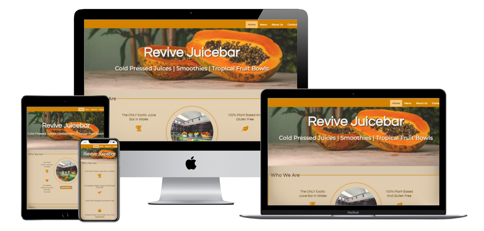</h2>

## User Experience (UX)

-   ### User stories

 #### Visitor Goals

        1. As a user, I want to easily understand the main purpose of this site, so that I can be sure if this is the right site for me
        2. As a user, I want to be able to navigate the website, so that I can easily navigate across the website and browse all the pages.
        3. As a user, I want to be able to visit the social media pages for this bar, so that can see the latest social media news shared.

-   ### Design
    -   #### Colour Scheme
        -   The main colours used are 
        #c7831d,
        #442e0c,
        and #b38540
        (https://coolors.co/c7831d-442e0c-b38540)
        <p></p>


    -   #### Typography
        -   The Montserrat font is the main font used throughout the whole website with Sans Serif as the fallback font in case for any reason the font isn't being imported into the site correctly. Montserrat is a clean font used frequently in programming, so it is both attractive and appropriate.
        <p>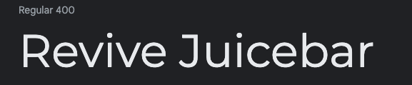</p>
        -   The Questrial font is the secondry font used throughout the  website with Sans Serif as the fallback, this is also a simple yet effective font type.
         <p></p>
    -   #### Imagery
        -   Imagery is important. The images used have been chosen to create a positive feeling as well as be appertising and inviting.

*   ### Wireframes

    -   Home Page Wireframe - 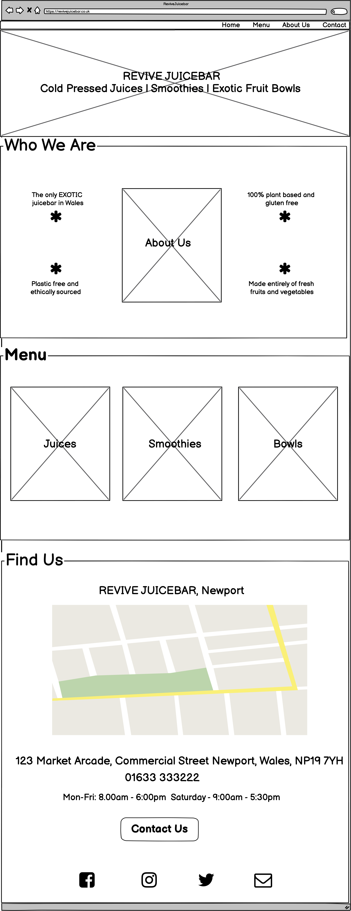

    -    Menu Page Wireframe - 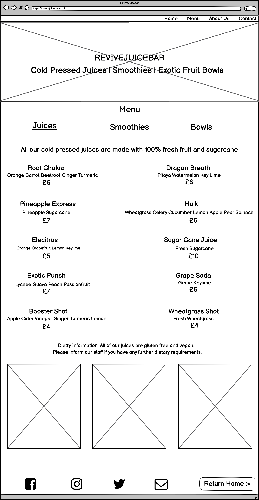

    -    About Us Page Wireframe - 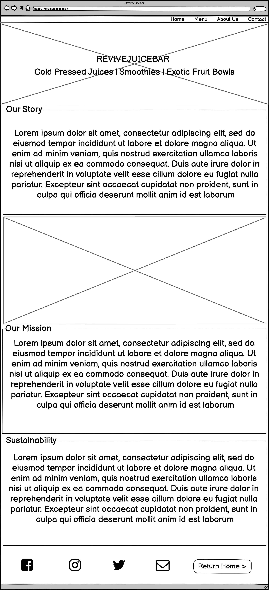

    -   Contact Us Page Wireframe - 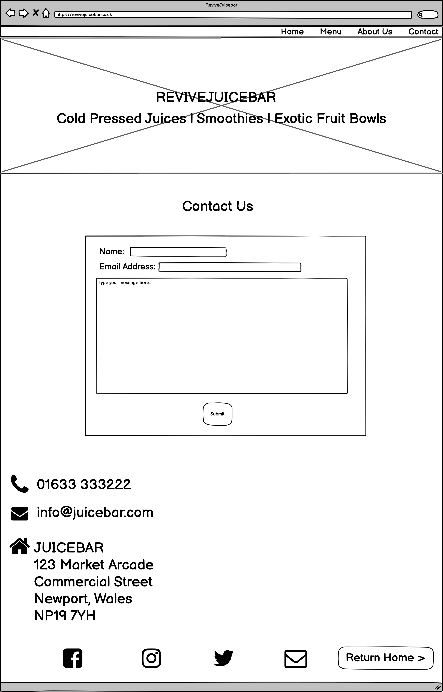

## Features

-   Website has been trialled and tested on many devices. It is fully responsive on all device sizes. This involved changing certain things on the webpages, some images and icons had to be removed to ensure the flow of the website made sense.

<p>
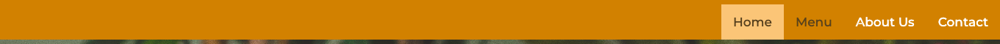</p>
The website features a Navigation bar which takes you through the main pages of the website. There is a highlighted background effect on the active page and the color changes on the text that is being hovered over with a mouse.


<p>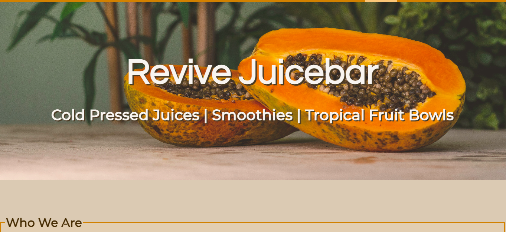
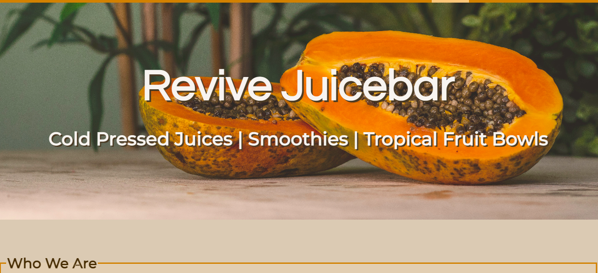</p>

There is a zoom feauture on the hero image making it larger when hovered over.

<p>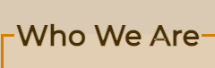
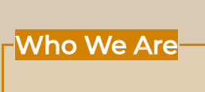</p>

When hovering over the section headings they are highlighted for effect.

<p>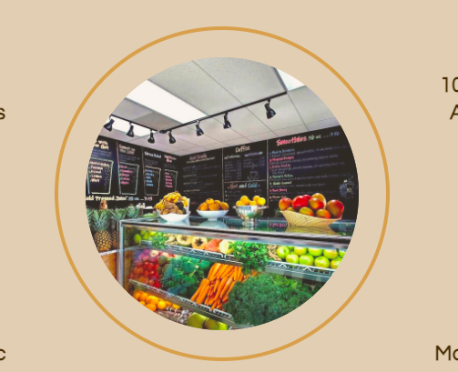
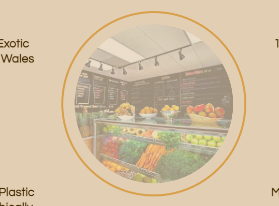</p>

The image at the center of the About Us section on the homepage is also a link to the About Us page, when hovered it is faded to indicate activity. I tried very hard to get a button to appear over it when it was faded, however I was not able to find the resources to work out how to do this, it is soemthing I would like to do in the future.

<p>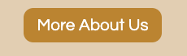
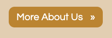</p>

I added buttons to navigate to relevant pages on the homepage. This button once hovered over or clicked unfolds an arrow for effect.

<p>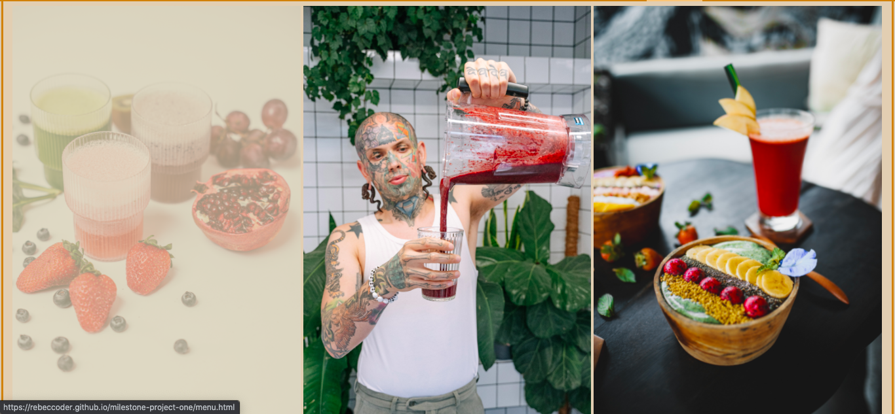</p>

The three images on the homepage that show juices, smoothies and bowls are also links to the relevant websites. This is indicated with a faded image once hovered. Again this isn't totally clear as I did not work out how to add a button that appears. This is why I also added the extra buttons above the images.

<p>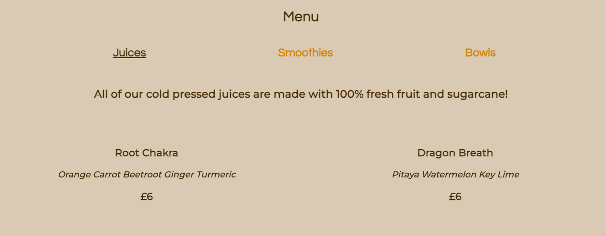
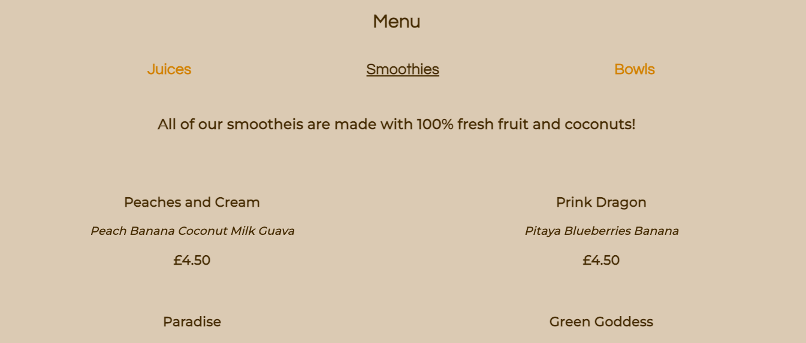
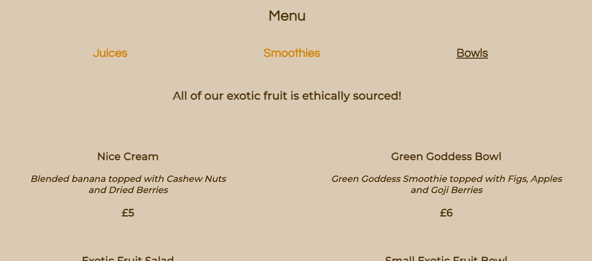</p>

For the Menu instead of trying to cram everything on to one menu I divided it into three sections on seperate html files that can be navigated through easily, each with 3 pictures of either juices, smoothies or bowls.. depending which page you were on.

<p></p>

A map to the homepage for users to easily find the juicebar was also included.


<p>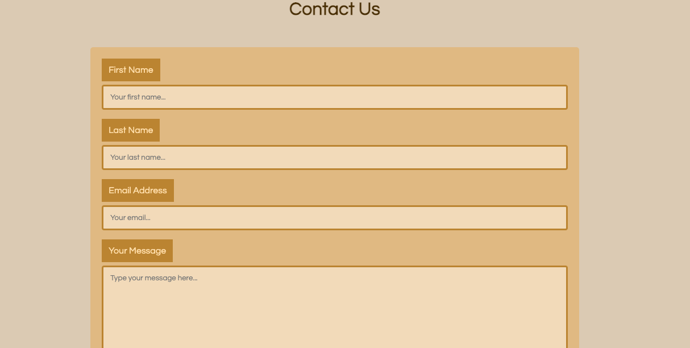</p>

A contact form was included on the contact form for a quick and easy form of communication.

<p>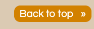</p>

For easier navigation I added a back-to-top link which brought the user back to the top of the current webpage when clicked.


## Technologies Used

[HTML Formatter:](https://webformatter.com/html)
    -  HTML Formatter was used to beautify the code.


### Languages Used

-   [HTML5](https://en.wikipedia.org/wiki/HTML5)
-   [CSS3](https://en.wikipedia.org/wiki/Cascading_Style_Sheets)

### Frameworks, Libraries & Programs Used

1. [Google Fonts:](https://fonts.google.com/)
    - Google fonts were used to import the 'Titillium Web' font into the style.css file which is used on all pages throughout the project.
1. [Font Awesome:](https://fontawesome.com/)
    - Font Awesome was used on all pages throughout the website to add icons for aesthetic and UX purposes.
1. [Git](https://git-scm.com/)
    - Git was used for version control by utilizing the Gitpod terminal to commit to Git and Push to GitHub.
1. [GitHub:](https://github.com/)
    - GitHub is used to store the projects code after being pushed from Git.
1. [Balsamiq:](https://balsamiq.com/)
    - Balsamiq was used to create the [wireframes](https://github.com/) during the design process.

## Testing

The W3C Markup Validator and W3C CSS Validator Services were used to validate every page of the project to ensure there were no syntax errors in the project.

-   [W3C Markup Validator](https://jigsaw.w3.org/css-validator/#validate_by_input) 
-   [W3C CSS Validator](https://jigsaw.w3.org/css-validator/#validate_by_input) 

### Testing User Stories from User Experience (UX) Section

[User Story Testing](https://github.com/rebeccoder/milestone-project-one/blob/main/assets/documentation/user-stories.pdf)


### Further Testing
- The project was tested on the following browsers with success, Google Chrome, Microsoft Edge, Safari, and Brave.
- Project was manually tested on a Macbook Air, iPhone 7 and a Moto G7 with success.
- Google Chrome Developer tools were used throughout the project to help me to test the responsiveness across devices.
- Google Chrome Developer tools used to emulate devices,
    - Apple iPad
    - Apple iPad Pro
    - Microsoft Surface Duo
    - Motorola G4
    - Samsung Galaxy S5
    - Google Pixel 2/2 XL
    - Apple iPhone 5/SE
    - Apple iPhone 6/7/8
    - Apple iPhone 6/7/8 Plus
    - Apple iPhone X

-   Friends and family members were asked to review the site and documentation to point out any bugs and/or user experience issues. I also asked a member of the Slack Community named Harry who helped a lot with debugging and pointing out UX details to add.

### Known Bugs
- There are currently no known bugs on the project, however, I did go through a debugging process all the way through which I should've documented in further detail, this is something I wish I had done and will do for future projects.

## Deployment

### GitHub Pages

The project was deployed to GitHub Pages using the following steps...

1. Log in to GitHub and locate the [GitHub Repository](https://github.com/)
2. At the top of the Repository (not top of page), locate the "Settings" Button on the menu.
    - Alternatively Click [Here](https://raw.githubusercontent.com/) for a GIF demonstrating the process starting from Step 2.
3. Scroll down the Settings page until you locate the "GitHub Pages" Section.
4. Under "Source", click the dropdown called "None" and select "Master Branch".
5. The page will automatically refresh.
6. Scroll back down through the page to locate the now published site [link](https://rebeccoder.github.io/milestone-project-one/index.html) in the "GitHub Pages" section.

### Forking the GitHub Repository

By forking the GitHub Repository we make a copy of the original repository on our GitHub account to view and/or make changes without affecting the original repository by using the following steps...

1. Log in to GitHub and locate the [GitHub Repository](https://github.com/)
2. At the top of the Repository (not top of page) just above the "Settings" Button on the menu, locate the "Fork" Button.
3. You should now have a copy of the original repository in your GitHub account.

### Making a Local Clone

1. Log in to GitHub and locate the [GitHub Repository](https://github.com/)
2. Under the repository name, click "Clone or download".
3. To clone the repository using HTTPS, under "Clone with HTTPS", copy the link.
4. Open Git Bash
5. Change the current working directory to the location where you want the cloned directory to be made.
6. Type `git clone`, and then paste the URL you copied in Step 3.

```
$ git clone https://github.com/rebeccoder/milestone-project-one
```

7. Press Enter. Your local clone will be created.

```
$ git clone https://github.com/rebeccoder/milestone-project-one
> Cloning into `CI-Clone`...
> remote: Counting objects: 10, done.
> remote: Compressing objects: 100% (8/8), done.
> remove: Total 10 (delta 1), reused 10 (delta 1)
> Unpacking objects: 100% (10/10), done.
```

Click [Here](https://help.github.com/en/github/creating-cloning-and-archiving-repositories/cloning-a-repository#cloning-a-repository-to-github-desktop) to retrieve pictures for some of the buttons and more detailed explanations of the above process.

## Credits

-   Code Institutes Love Running Project 

-   W 3 Schools https://www.w3schools.com/ which I checked many times for helpful codes to help make my own work how I wanted it to 

-   Stack Overflow https://stackoverflow.com/ which also had a lot of useful code to help find missing pieces to my work

### Code

-   The Nav bar code was a w3school template that I added to 

-   I used "image-rendering" as well as "filter: blur 10;" on the banner image to make it clear , I found this code on Stackoverflow

-   I found the code for the offer effect on the banner on https://css-tricks.com/

- The About Us section on the homepage was highly influenced by the code used in the Love Running Project by Code Institute.

### Content

-   All content was written by the developer.

### Media
All images used were found on the following websites:

https://unsplash.com/

https://pixabay.com/

https://www.pexels.com/


### Acknowledgements

-   My Mentor for continuous helpful feedback. 

-   Tutor support at Code Institute for their support in helping me to debug my code

- Harry Dhillon (full stack dev student who completed the code institute course) for assisting in the UX of my webpage.